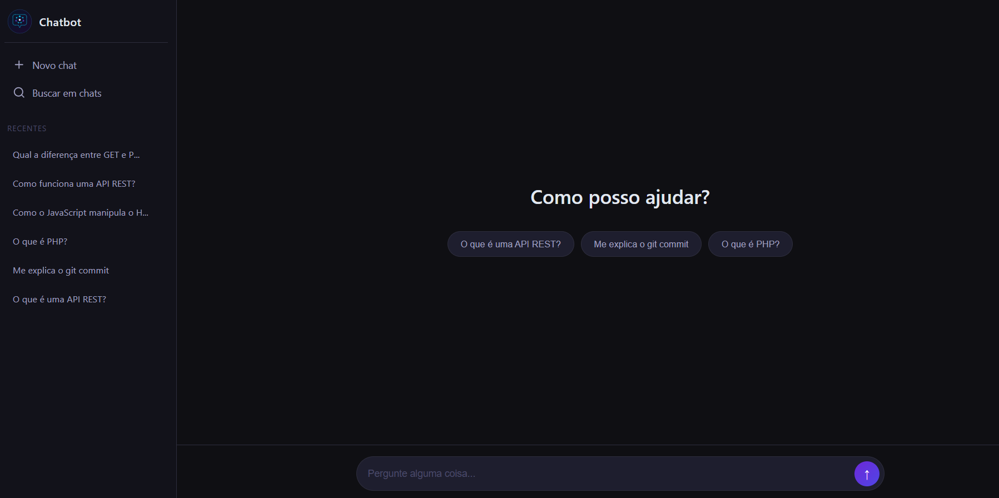

# 💬 Chatbot com OpenAI API

Chatbot conversacional com histórico de sessão, capaz de responder perguntas sobre qualquer assunto.  
Desenvolvido com PHP no backend e JavaScript puro no frontend, integrado à API da OpenAI.


## 📸 Screenshot



## 🚀 Tecnologias utilizadas

- PHP 8 + cURL
- JavaScript (Fetch API)
- HTML5 + CSS3
- OpenAI API (gpt-4o-mini)

## 💡 Funcionalidades

- Envio de mensagens em tempo real
- Histórico de conversa mantido durante a sessão
- Interface responsiva e moderna
- Integração com a API da OpenAI

## ⚙️ Como rodar localmente

1. Clone o repositório:
```bash
git clone https://github.com/evellinsimoes/chatbot-openai.git
```

2. Entre na pasta do projeto:
```bash
cd chatbot-openai
```

3. Crie o arquivo de configuração:
```bash
cp backend/.env.example backend/.env
```

4. Abra o arquivo `backend/.env` e adicione sua chave:
```
OPENAI_API_KEY=sua-chave-aqui
```

5. Suba o servidor PHP:
```bash
php -S localhost:8000
```

6. Acesse no navegador: `http://localhost:8000/frontend`

## 🔒 Segurança

O arquivo `.env` com a chave da API está no `.gitignore` e nunca é enviado para o repositório.

## 🤖 Ferramentas de IA utilizadas

Este projeto foi desenvolvido com auxílio do [Claude](https://claude.ai) (Anthropic)
para suporte no desenvolvimento, estruturação do código e boas práticas.

## 👩‍💻 Autora

Évellin Simões  
LinkedIn: [linkedin.com/in/evellin-simoes](https://linkedin.com/in/evellin-simoes)  
GitHub: [github.com/evellinsimoes](https://github.com/evellinsimoes)
